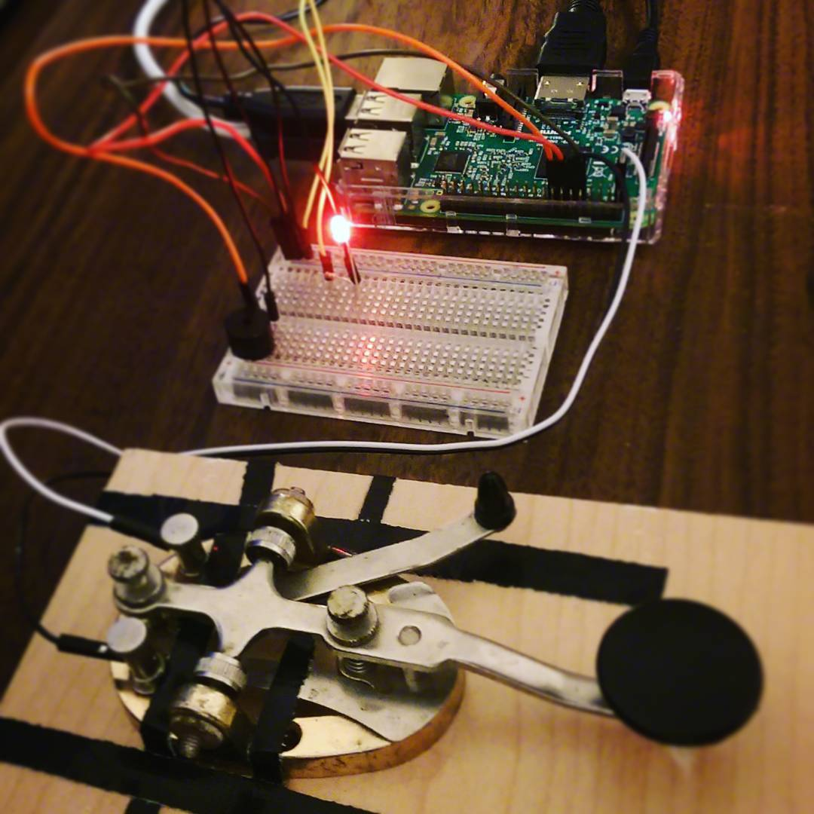

# morse-code-pi
A Morse Code Key interpreter for Raspberry Pi 3 in Python

## Project Goals
My partner Julia has an old J-38 WWII Telegraphy Key (Transmitter). One of the last antiques she bought with her mother before her passing.

The goal of this project is to make that key transmit text to Twitter and make it a permanent fixture in our apartment.

## Setup



### Telegraph Key

The J-38 telegraph key has two binding posts attached to its base on the opposite end from the key knob. In operation, it simply completes a circuit between these on a downward press of the knob.

### Controller

I had an old [Arduino Duemilanove](https://www.arduino.cc/en/Main/ArduinoBoardDuemilanove)  I was planning to use for this project, but decided to pick up a Raspeberry Pi 3 instead, as a WiFi hat for the old Arduino seemed to cost just as much, if not more.

It feels like overkill to have a gigabyte of ram and such to run this, but who doesn't want an excuse to mess with a Raspberry Pi? Come on. :)

### Interface

I attached two leads from the J-38 telegraph key binding posts to Pins 1 (3.3.V) and 11 (GPIO17) on the GPIO header, using the internal pull-down resistor to steady the input.

This seems to make for a totally detectable input, with some thresholding in code to make up for a bit of bounciness.

## Approach

On a keypress, input is measured from release time, taking a measurement of the duration of the press to determine a dit (.) or a dah (-), and subsequent measurement of the time elapsed since release to determine the threshold to cut off characters, words, and eventually the final message.

This is recorded into a buffer in a common style of dashes, dots, spaces and slashes, wherein HELLO WORLD would be recorded as follows:

.... . .-.. .-.. --- / .-- --- .-. .-.. -..

Upon detection of a completed message, this is then translated into english characters using a simple stored Morse Code dictionary in the same format.

## Running This Project
This project was initially made in Python 2.7.13 since that's what came default on the default Raspbian installation.

- Python 2.7.13
- Raspbian 9

To get it to start listening for input just run the morse.py file.

```
python morse.py
```

Thresholds for dit, dah, characters, words, etc. are adjustable constants in the script.

### Code Caveat
I am not the most Pythonic programmer. While it functions at the moment, it's also probably garbage, style-wise. I hope to clean that up soon.

## Twitter Interface
Coming soon :)
